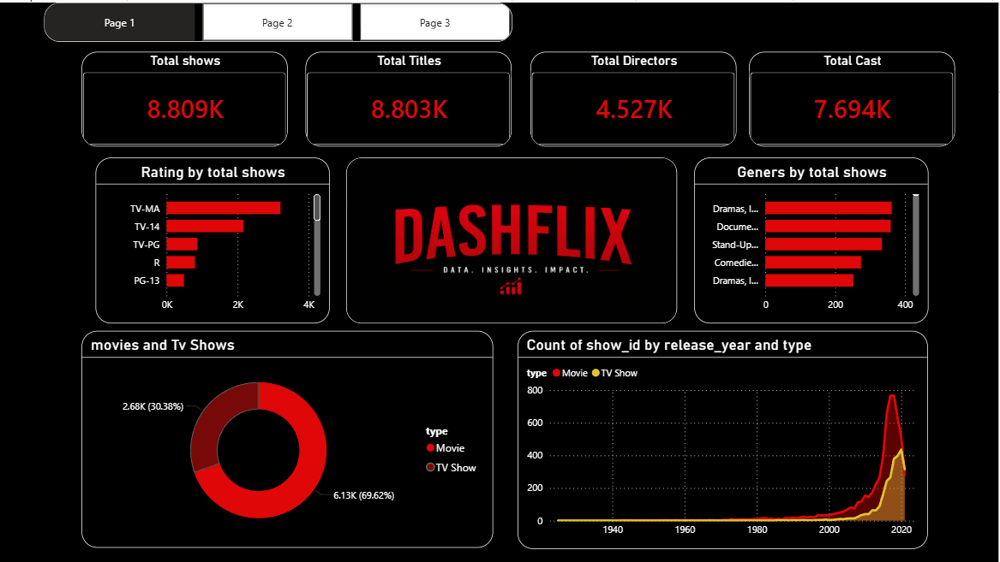
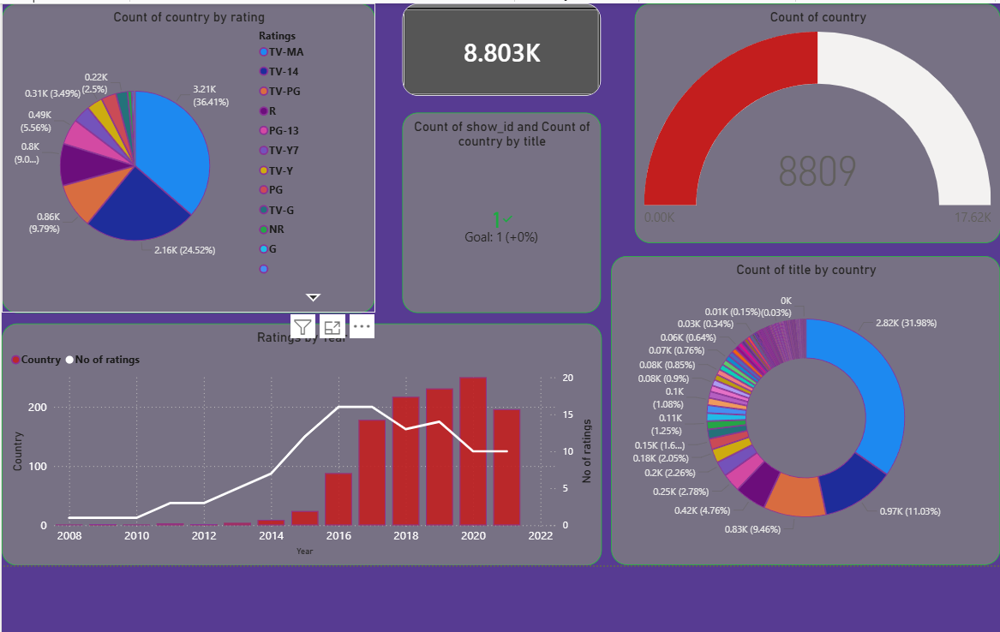
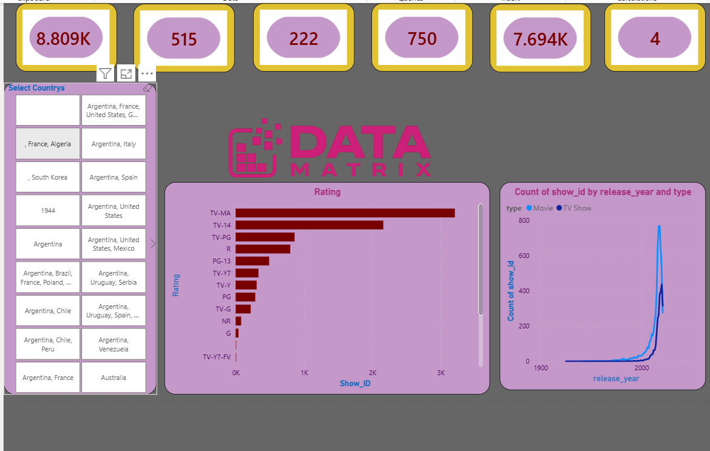

# Power-bi-dashboard-2

# DashFlix – Streaming Content Analytics Dashboard

An interactive multi-page Power BI dashboard analyzing streaming content data — covering show/title metrics, ratings, genres, country-wise distribution, and release trends across Movies and TV Shows.

## 📌 Overview

DashFlix turns a large streaming content catalog into a clear, explorable analytics dashboard across three pages — a content overview, a KPI/country breakdown, and a country-filtered deep-dive — helping surface trends in ratings, genres, and content growth over time.

## 🛠️ Tools & Technologies

- **Power BI** – Dashboard design & interactive visualizations
- **Power Query** – Data cleaning and transformation
- **DAX** – Calculated measures (Total Shows, Total Titles, Total Directors, Total Cast, etc.)

## ✨ Key Features

### Page 1 — Overview
- **KPI Cards** – Total Shows (8.809K), Total Titles (8.803K), Total Directors (4.527K), Total Cast (7.694K)
- **Rating by Total Shows** – Bar chart breakdown across TV-MA, TV-14, TV-PG, R, PG-13
- **Genres by Total Shows** – Top genres ranked by content volume
- **Movies vs. TV Shows** – Donut chart showing content-type split (69.62% Movies / 30.38% TV Shows)
- **Count of show_id by Release Year and Type** – Trend line comparing Movie vs. TV Show releases over time

### Page 2 — KPI & Country Analysis
- **Count of Country by Rating** – Pie chart showing rating distribution across countries
- **Country Gauge Visual** – Progress indicator showing count of countries represented (8,809)
- **Count of Title by Country** – Donut chart showing content distribution across countries
- **Ratings by Year** – Combo chart (bar + line) tracking number of ratings and country count over time (2008–2022)

### Page 3 — Data Matrix (Country Filter View)
- **Summary KPI Cards** – Shows, countries, genres, and cast/crew counts at a glance
- **Select Countries Slicer** – Interactive multi-select filter to drill into specific countries or country combinations
- **Rating Breakdown** – Horizontal bar chart of show counts by rating, filtered by selected countries
- **Count of show_id by Release Year and Type** – Filtered trend view by Movie/TV Show type

## 📊 Dashboard Preview

**Page 1 – Overview**

**Page 2 – KPI & Country Analysis**

**Page 3 – Data Matrix**

## 💡 Business Value

- Gives content teams a quick read on catalog composition (Movies vs. TV Shows, genres, ratings)
- Country-level filtering helps identify regional content strengths and gaps
- Release-year trends highlight content growth patterns to support acquisition/production planning

## 📁 Repository Contents

| File | Description |
|---|---|
| `Dashboard Dashflix and Data matrix.pbix` | Power BI dashboard file |
| `Dashflix.png` | Page 1 screenshot — Overview |
| `Kpi.png` | Page 2 screenshot — KPI & Country Analysis |
| `Datamatrix.png` | Page 3 screenshot — Data Matrix |
| `README.md` | Project documentation |

## 👤 Author

**Vageesh R G**
Data Analyst | Healthcare Data & Business Intelligence
[LinkedIn](https://linkedin.com/in/vageeshrg)
